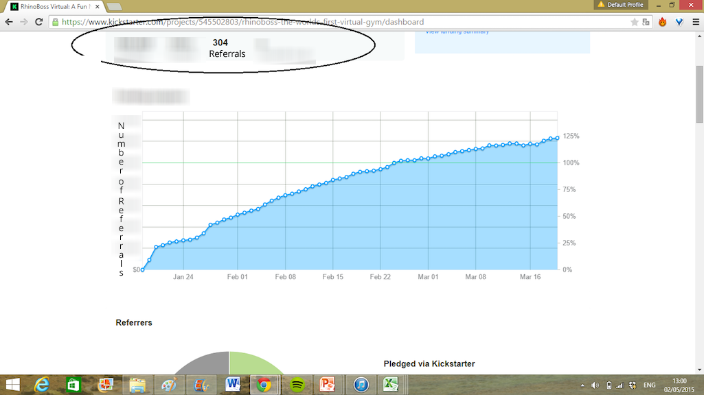
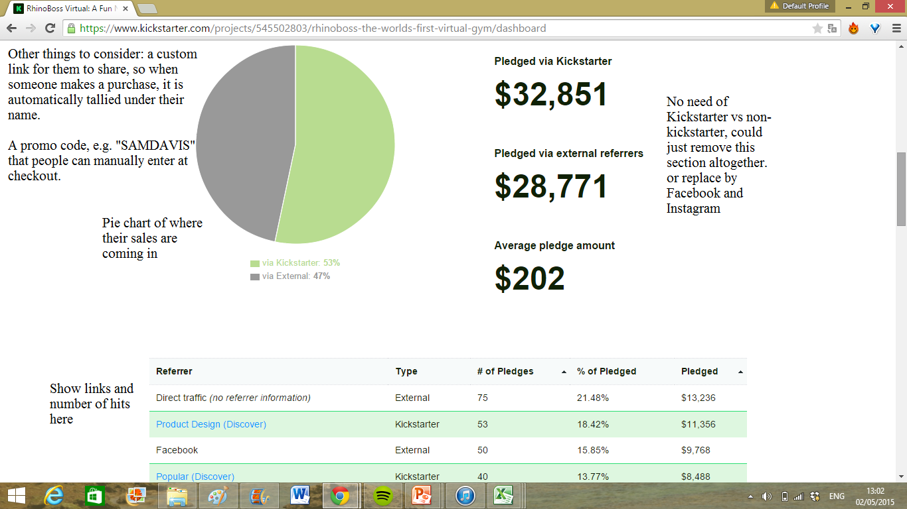

## High Level Requirements. Codename: "CrossBit"
### Summary and Narrative
Described is a platform that connects virtual trainers who want to train people in exercises to virtual members who want to learn new exercises. The platform allows trainers log into the main website and build their profile. Here the trainer can upload a training video from their computer at the push of the button. Upon uploading the video the trainer can pick different properties and attributes of the video from a set of drop down that can categorize the video. An example of this is a trainer can pick the muscle groups the video targets picking something such as "arms" or "biceps". The categories the trainer can pick from are added via an admin panel that only select admin users have access to. The trainer can also schedule live workout sessions via a simple calendar tool. When scheduling a live stream the trainer has the ability to set the same options as when he uploaded the non-live video. The live training sessions allows a trainer to live stream video from his webcam to multiple members who are online and watching so that the members may follow along with the trainer.
The members are able to access the videos on the website once they sign up for a subscription. The user can pick a trial subscription where their payment information is billed only after the trial period is up. Once the user has purchased a subscription they are able to access the features of the website. Upon login the users are able to search for videos from various trainers by picking and choose various filters. Once a video is chosen it takes them to the page which shows the embedded video along with any pertinent information on the video. The user can favorite a video, rate a video, or mark a video as completed. A video can be marked completed multiple times as a user may have watched and "completed" the video multiple times in the same week. The member can click on the trainer of the video and see the profile page of the trainer. The member can see a schedule of upcoming live stream videos which can also be filtered on various search terms. Click a link to these scheduled videos will allow a member to participate in the exercise with the trainer at the scheduled time. Once entered in the live stream video session, A member can choose to enable or disable their camera to prevent the trainer from seeing them. The trainer has a view which shows all the video of those who have allowed their video to be broadcast.
The website also has a "shop" section that allows users to buy equipment that they would need for their workout. The checkout system would include payment processing as well as a tracked referral code discount. This would allow users to generate referral codes and share the referral code via link. Applying a referral code would give discounts as well as allow tracking to occur. When a user shares his referral code and another user uses this referral code successfully. The user would be able to see statistics on how many people have used their referral code via a dashboard.
A member can connect other accounts (Facebook), update their username and password, fine referral codes and update their billing information from their user settings. Additionally, members can contact and message trainers by clicking on a "message" button in the profile of the trainer.

### Detailed Requirements
The following set of requirement describe the currently understood scope of the application. Specific requirements may have a scope that would require its implementation in a future version. Those are called out where applicable. Only v1 is applicable for the first scope. Higher version numbers are there to allow us to know the potential next steps you are planning on taking. This allows us to make design decisions to support your future versions with minimum rework.

| Domain      | Description                                                                                        | Version |
| ---         | ---                                                                                                | ---     |
| login       | ability for virtual gym member login                                                               | v1      |
| login       | ability for virtual gym trainer to login                                                           | v1      |
| login       | user can sign up using email address                                                               | v1      |
| login       | user can sign up using Facebook                                                                    | v1      |
| login       | user can sign up using Google+                                                                     | v1      |
| login       | user can sign up using Instagram                                                                   | v1      |
| login       | user can sign up using LinkedIn                                                                    | v2      |
| login       | user can sign up using Twitter                                                                     | v1      |
| permissions | unique permissions for gym trainer                                                                 | v1      |
| permissions | unique permissions for gym member                                                                  | v1      |
| profile     | trainer can fill out a profile                                                                     | v1      |
| profile     | trainer can import profile from Facebook                                                           | v1      |
| profile     | trainer can import profile from LinkedIn                                                           | v1      |
| profile     | trainer can attach images to profile                                                               | v1      |
| profile     | trainer can include link Facebook account                                                          | v1      |
| profile     | trainer can include link Instagram account                                                         | v1      |
| profile     | trainer can include link to YouTube account                                                        | v1      |
| profile     | trainer can fill out free form text field about themselves                                         | v1      |
| profile     | trainer can attach 3 hashtags                                                                      | v1      |
| profile     | trainer can include the style of training freeform field                                           | v1      |
| profile     | trainer can include 3 styles of training                                                           | v1      |
| profile     | trainer profile page includes all videos they have uploaded                                        | v1      |
| profile     | trainer can include more styles of training                                                        | v3      |
| profile     | member can fill out a profile                                                                      | v2      |
| profile     | member can import profile from Facebook                                                            | v2      |
| profile     | member can import profile from LinkedIn                                                            | v2      |
| profile     | member can attach images to profile                                                                | v2      |
| profile     | member can include link Facebook account                                                           | v2      |
| profile     | member can include link Instagram account                                                          | v2      |
| profile     | member can include link to YouTube account                                                         | v2      |
| profile     | member can fill out free form text field about themselves                                          | v2      |
| profile     | member can track progress by taking periodic pictures                                              | v3      |
| progress    | member pushes button to show completion of the video                                               | v2      |
| progress    | member profile page includes progress and completion tracking                                      | v2      |
| progress    | member profile page report charts progress                                                         | v2      |
| progress    | point system and gamification                                                                      | v2      |
| contact     | member can contact trainer for session                                                             | v1      |
| contact     | member can initiate contact to trainer for session                                                 | v1      |
| contact     | trainer can not initiate contact to member for session                                             | v1      |
| group-video | trainers can broadcast live video to members who can join and watch                                | v1      |
| group-video | members can see username and optional video of member                                              | v1      |
| group-video | members can't see other members                                                                    | v1      |
| group-video | trainers can add live video broadcast to schedule                                                  | v1      |
| group-video | members can see schedule of upcoming live videos                                                   | v1      |
| group-video | max members on the trainer video is currently 6                                                    | v1      |
| video       | trainer can add YouTube video recording they have made using url                                   | v2      |
| video       | trainer can add YouTube video via embedded button to RB account                                    | v2      |
| video       | trainer can directly upload video via embedded button on page                                      | v1      |
| video       | trainer can specify muscle group tags for video                                                    | v1      |
| video       | trainer can specify calories for video                                                             | v1      |
| video       | trainer can specify exercise type (yoga, football, mma)                                            | v1      |
| video       | trainer can specify required equipment                                                             | v1      |
| video       | member can search for video based on required equipment                                            | v1      |
| video       | member can save a video into a favorite list                                                       | v1      |
| video       | trainer can specify fitness level                                                                  | v1      |
| video       | member can search for video based on fitness level                                                 | v1      |
| video       | trainer can specify workout goal (fat, muscle, etc)                                                | v1      |
| video       | member can search for video based on workout goal                                                  | v1      |
| video       | member can search for video based on muscle group                                                  | v1      |
| video       | user can see image of muscle groups based on images                                                | v1      |
| video       | member can search for video based on calories                                                      | v1      |
| video       | member can search for video based on exercise type                                                 | v1      |
| video       | member can rate video quaity                                                                       | v1      |
| video       | member can see video quality                                                                       | v2      |
| video       | member can specify issue with video when rating is under threshold                                 | v1      |
| video       | member can search for video based on time uploaded                                                 | v2      |
| video       | member can search for video based on workout time                                                  | v1      |
| video       | member can share video on Facebook                                                                 | v2      |
| tracking    | track users through pages                                                                          | v1      |
| tracking    | perform automatic analytics of users on pages                                                      | v1      |
| tracking    | review data of users through pages (basic analytics)                                               | v1      |
| site-wide   | responsive design                                                                                  | v1      |
| site-wide   | breakpoint based design allowing layout changes                                                    | v1      |
| site-wide   | nested design                                                                                      | v2      |
| site-wide   | desktop first                                                                                      | v1      |
| site-wide   | vector based images                                                                                | v1      |
| referral    | generate referral code for all users                                                               | v1      |
| referral    | track referral code for user sign up                                                               | v1      |
| referral    | analytics on referral code                                                                         | v2      |
| referral    | raw data on referral code                                                                          | v1      |
| referral    | allow user to customize referral code                                                              | v2      |
| referral    | referral code field during sign up                                                                 | v1      |
| referral    | referral code automatically redirects to sign up and auto fill                                     | v2      |
| referral    | link to amazon products when trying to buy equipment                                               | v2      |
| referral    | dashboard which allows users to see how many other users have used their referral code [Dashboard] | v1      |
| qr code     | scanned qr code takes user to video page                                                           | v1      |
| qr code     | scanned qr code requires logged in user                                                            | v1      |
| qr code     | allow site to scan qr code                                                                         | v1      |
| payment     | accept reoccurring payment                                                                         | v1      |
| payment     | require payment by user                                                                            | v1      |
| payment     | accept PayPal as payment method                                                                    | v1      |
| payment     | accept visa/mastercard as payment method                                                           | v1      |
| payment     | accept american express as payment method                                                          | v1      |
| payment     | accept bitcoin as payment method                                                                   | v1      |
| payment     | accept Amazon as payment method                                                                    | v2      |
| customize   | allow subdomains such as for Proctor Gamble                                                        | v2      |
| customize   | allow subdomains to have different graphics/branding                                               | v2      |
| admin panel | allows admins to change any properties for the videos upload                                       | v1      |
| admin panel | allows admins to remove vidoe content any trainer has uploaded                                     | v1      |

### Legend

#### Domain:
The high level component of the app which the requirement is related to.

#### Description:
The detailed description of the requirement for the app in the specified domain.

#### Version:
The version of the app the requirement would be present in. V1 represents the initial version from the high level scope. V2 might describe
a few months later after discussing a scope change or amendment.

#### Priority:
The relative importance of the requirement to the app as a whole.

#### Image Assets
##### Dashboard

