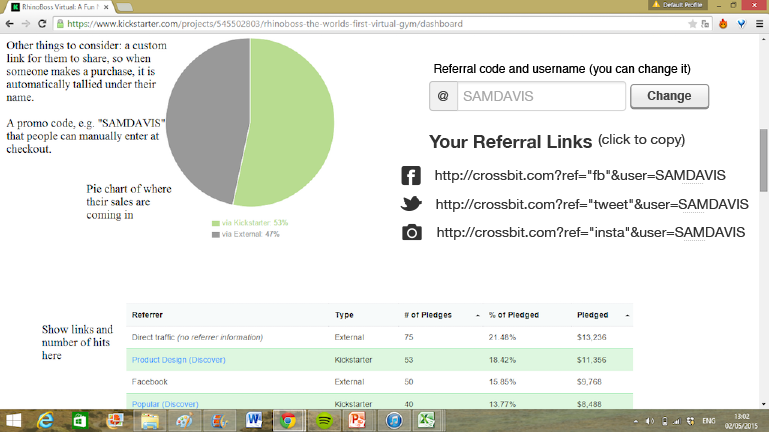

## High Level Requirements. Codename: "CrossBit"
### Summary and Narrative
Described is a platform that connects virtual trainers who want to train people in exercises to virtual members who want to learn new exercises. The platform allows trainers log into the main website and build their profile. Here the trainer can upload a training video from their computer at the push of the button. Upon uploading the video the trainer can pick different properties and attributes of the video from a set of drop down that can categorize the video. An example of this is a trainer can pick the muscle groups the video targets picking something such as "arms" or "biceps". The categories the trainer can pick from are added via an admin panel that only select admin users have access to. The trainer can also schedule live workout sessions via a simple calendar tool. When scheduling a live stream the trainer has the ability to set the same options as when he uploaded the non-live video. The live training sessions allows a trainer to live stream video from his webcam to multiple members who are online and watching so that the members may follow along with the trainer.
Upon login the users are able to search for videos from various trainers by picking and choose various filters. Once a video is chosen it takes them to the page which shows the embedded video along with any pertinent information on the video. The user can favorite a video, rate a video, or mark a video as completed. A video can be marked completed multiple times as a user may have watched and "completed" the video multiple times in the same week. The member can click on the trainer of the video and see the profile page of the trainer. The member can see a schedule of upcoming live stream videos which can also be filtered on various search terms. Click a link to these scheduled videos will allow a member to participate in the exercise with the trainer at the scheduled time. Each session requires either a monthly membership to the trainer or requires a single time cost to access either the one-many session or recorded session. 
The system would include payment processing as well as a tracked referral code discount. This would allow users to generate referral codes and share the referral code via link. Applying a referral code would give discounts as well as allow tracking to occur. When a user shares his referral code and another user uses this referral code successfully. The user would be able to see statistics on how many people have used their referral code via a dashboard.
A member can connect other accounts (Facebook), update their username and password, fine referral codes and update their billing information from their user settings. Additionally, members can contact and message trainers by clicking on a "message" button in the profile of the trainer.

### Detailed Requirements
The following set of requirement describe the currently understood scope of the application. Specific requirements may have a scope that would require its implementation in a future version. Those are called out where applicable. Only v1 is applicable for the first scope. Higher version numbers are there to allow us to know the potential next steps you are planning on taking. This allows us to make design decisions to support your future versions with minimum rework.

| Domain      | Description                                                                          | Ver | MVP | App |
| ---         | ---                                                                                  | --- | --- | --- |
| login       | ability for virtual gym member login                                                 | v1  | x   | d   |
| login       | ability for virtual gym trainer to login                                             | v1  | x   | d   |
| login       | member asked to sign up right before playing video, not at beginning                 | v1  |     | d   |
| login       | user can sign up using email address                                                 | v1  | x   | d   |
| login       | user can sign up using Facebook                                                      | v1  | x   | d   |
| login       | user can sign up using Google+                                                       | v1  |     | d   |
| login       | user can sign up using Instagram                                                     | v1  |     | d   |
| login       | user can sign up using LinkedIn                                                      | v2  |     |     |
| login       | user can sign up using Twitter                                                       | v1  |     | d   |
| permissions | unique permissions for gym trainer (ex. can upload video)                            | v1  | x   | d   |
| permissions | unique permissions for gym member                                                    | v1  | x   | d   |
| profile     | trainer can fill out a profile                                                       | v1  | x   | d   |
| profile     | trainer can import profile from Facebook                                             | v2  |     |     |
| profile     | trainer can import profile from LinkedIn                                             | v2  |     |     |
| profile     | trainer can attach images to profile                                                 | v1  |     | d   |
| profile     | trainer can include link Facebook account                                            | v1  |     | d   |
| profile     | trainer can include link Instagram account                                           | v1  |     | d   |
| profile     | trainer's Instagram account automatically populates onto their profile page          | v1  |     | d   |
| profile     | trainer can fill out free form text field about themselves                           | v1  | x   | d   |
| profile     | trainer can attach 5 hashtags                                                        | v1  |     | d   |
| profile     | upcoming trainer scheduled sessions                                                  | v1  | x   | d   |
| profile     | trainer can upload 'intro video' talking about themselves                            | v1  |     | d   |
| profile     | trainer profile page includes all videos they have uploaded/recorded                 | v1  |     | d   |
| profile     | member can fill out credit card information                                          | v1  | x   | d   |
| profile     | member can manage subscriptions                                                      | v1  | x   | d   |
| profile     | member can fill out a profile                                                        | v2  |     |     |
| profile     | member can import profile from Facebook                                              | v2  |     |     |
| profile     | member can import profile from LinkedIn                                              | v2  |     |     |
| profile     | member can attach images to profile                                                  | v2  |     |     |
| profile     | member can include link Facebook account                                             | v2  |     |     |
| profile     | member can include link Instagram account                                            | v2  |     |     |
| profile     | member can include link to YouTube account                                           | v2  |     |     |
| profile     | member can fill out free form text field about themselves                            | v2  |     |     |
| profile     | member can track progress by taking periodic pictures                                | v3  |     |     |
| progress    | member pushes button to show completion of the video                                 | v2  |     |     |
| progress    | member profile page includes progress and completion tracking                        | v2  |     |     |
| progress    | member profile page report charts progress                                           | v2  |     |     |
| progress    | point system and gamification                                                        | v2  |     |     |
| contact     | member can contact trainer for session                                               | v1  | x   | d   |
| contact     | member can initiate contact to trainer for session                                   | v1  | x   | d   |
| contact     | trainer can not initiate contact to member for session                               | v1  | x   | d   |
| calendar    | member can see calendar of upcoming events they have scheduled                       | v1  | x   | d   |
| calendar    | member can see calendar of all upcoming events that they do NOT have scheduled       | v1  |     | d   |
| reminder    | email reminder for training session that comes up (1 hr reminder)                    | v1  | x   | d   |
| reminder    | email reminder for upcoming training session is customizeable by the trainer         | v1  |     | d   |
| reminder    | email reminder for training session for favorite trainer                             | v1  |     | d   |
| live-video  | trainers can broadcast live video to members who can join and watch                  | v1  | x   | m   |
| live-video  | trainers can broadcast live audio members who can join and watch                     | v1  | x   | m   |
| live-video  | trainers can group stream live video to members who can join and watch               | v1  | x   | m   |
| live-video  | trainers can group stream live audio to members                                      | v1  | x   | m   |
| live-video  | members can group stream live audio to trainer                                       | v1  | x   | m   |
| live-video  | members can mute live audio to trainer                                               | v2  |     | m   |
| live-video  | members can mute live audio from other members                                       | v2  |     | m   |
| live-video  | trainers can 1v1 stream live video to members who can join and watch                 | v1  | x   | m   |
| live-video  | trainers can 1v1 stream live audio to member                                         | v1  | x   | m   |
| live-video  | members can 1v1 stream live audio to trainer                                         | v1  | x   | m   |
| live-video  | members can 1v1 mute live audio to trainer                                           | v2  |     | m   |
| live-video  | trainer can specify the cost to view live video                                      | v1  | x   | d   |
| calendar    | trainers can schedule a video (one to many)                                          | v1  | x   | d   |
| calendar    | trainers can schedule a video (one to group)                                         | v1  | x   | d   |
| calendar    | trainers can offer time slots their are available (1v1)                                         | v1  | x   | d   |
| calendar    | members can pick time slots their trainer have pre approved (1v1)                                         | v1  | x   | d   |
| live-video  | trainers can fill in custom information about the video session                      | v1  | x   | d   |
| live-video  | trainer can schedule member to one-on-one private training session                   | v1  | x   | d   |
| live-video  | members can see username and optional video of member                                | v1  |     | m   |
| live-video  | members can real-time chat with trainer                                              | v1  |     | m   |
| live-video  | members can choose to hide or share their own video with trainer                     | v1  |     | m   |
| live-video  | members can choose to hide or share their own video with other members               | v1  |     | m   |
| calendar    | trainers can add live video broadcast to schedule                                    | v1  | x   | d   |
| live-video  | max members on the trainer video is currently 6                                      | v1  | x   | d   |
| video       | record live training video into archive under trainer account                        | v1  | x   | d   |
| video       | delete/manage recorded live training video                                           | v1  | x   | d   |
| video       | trainer can add existing YouTube video recording they have made using url            | v2  |     |     |
| video       | trainer can add existing YouTube video via embedded button to RB account             | v1  |     | d   |
| video       | trainer can directly upload video via embedded button on page                        | v1  |     | d   |
| video       | trainer can specify the cost to view individual recorded view                        | v1  |     | d   |
| video       | trainer can specify muscle group tags for video                                      | v1  |     | d   |
| video       | trainer can specify calories for video                                               | v1  |     | d   |
| video       | trainer can specify exercise type (yoga, football, mma)                              | v1  |     | d   |
| video       | trainer can specify required equipment                                               | v1  |     | d   |
| video       | trainer can specify open text description for video                                  | v1  |     | d   |
| video       | trainer can specify email reminder text for the video                                | v1  |     | d   |
| video       | member can search for video based on required equipment                              | v1  |     | d   |
| video       | member can save a video into a favorite list                                         | v1  |     | d   |
| video       | trainer can specify fitness level                                                    | v1  |     | d   |
| video       | member can search for video based on fitness level                                   | v1  |     | d   |
| video       | trainer can specify workout goal (fat, muscle, etc)                                  | v1  |     | d   |
| video       | member can search for video based on workout goal                                    | v1  |     | d   |
| video       | member can search for video based on muscle group                                    | v1  |     | d   |
| video       | user can see image of muscle groups based on video                                   | v1  |     | d   |
| video       | member can search for video based on calories                                        | v1  |     | d   |
| video       | member can search for video based on exercise type                                   | v1  |     | d   |
| video       | member can rate video quaity (out of 5 stars)                                        | v1  |     | d   |
| video       | member can see video quality rating                                                  | v2  |     |     |
| video       | member has countdown on video page that shows time remaining (large text)            | v2  |     |     |
| video       | member can specify issue with video when rating is under threshold (under 4)         | v2  |     |     |
| video       | member can search for video based on date uploaded                                   | v2  |     |     |
| video       | member can search for video based on video length                                    | v2  |     |     |
| video       | member can share workout session on Facebook                                         | v1  |     | d   |
| messaging   | users can message each other                                                         | v1  |     | d   |
| tracking    | track users through pages                                                            | v1  |     | d   |
| tracking    | perform automatic analytics of users on pages                                        | v1  |     | d   |
| tracking    | review data of users through pages (basic analytics)                                 | v1  |     | d   |
| site-wide   | responsive design                                                                    | v1  |     | d   |
| site-wide   | breakpoint based design allowing layout changes                                      | v1  |     | d   |
| site-wide   | nested design                                                                        | v2  |     |     |
| site-wide   | desktop first                                                                        | v1  |     | d   |
| site-wide   | vector based images                                                                  | v1  |     | d   |
| referral    | generate referral code for all users                                                 | v1  |     | d   |
| referral    | track referral code for user sign up                                                 | v1  |     | d   |
| referral    | analytics on referral code                                                           | v2  |     |     |
| referral    | raw data on referral code                                                            | v1  |     | d   |
| referral    | allow user to customize referral code                                                | v1  |     | d   |
| referral    | referral code field during sign up                                                   | v1  |     | d   |
| referral    | referral code field during any purchase                                              | v1  |     | d   |
| referral    | referral code automatically redirects to sign up and auto fill                       | v1  |     | d   |
| referral    | referral code gives discount to person using it                                      | v1  |     | d   |
| referral    | link to amazon products when trying to buy equipment                                 | v2  |     |     |
| referral    | user gets credit for referring another user that signed up for the platform          | v1  |     | d   |
| qr code     | scanned qr code takes user to video page                                             | v2  |     |     |
| qr code     | scanned qr code requires logged in user                                              | v2  |     |     |
| qr code     | allow site to scan qr code                                                           | v2  |     |     |
| payment     | accept reoccurring payment                                                           | v1  | x   | d   |
| payment     | require payment by user                                                              | v1  | x   | d   |
| payment     | accept PayPal as payment method                                                      | v1  | x   | d   |
| payment     | accept visa/mastercard as payment method                                             | v1  | x   | d   |
| payment     | accept american express as payment method                                            | v1  | x   | d   |
| payment     | accept bitcoin as payment method                                                     | v2  |     |     |
| payment     | accept Amazon as payment method                                                      | v2  |     |     |
| payment     | trainer can set monthly price for one-many videos and recorded videos                | v1  | x   | d   |
| payment     | trainer can set individual price for one-many video                                  | v1  | x   | d   |
| payment     | trainer can set individual price for recorded video                                  | v1  |     | d   |
| customize   | allow subdomains such as for Proctor Gamble                                          | v2  |     |     |
| customize   | allow subdomains to have different graphics/branding                                 | v2  |     |     |
| admin panel | allows admins to change any properties(calories, muscle group) for the videos upload | v1  |     | d   |
| admin panel | allows admins to remove video content any trainer has uploaded                       | v1  | x   | d   |
| shop        | allows user to purchase physical items from a small shop (5-10 items)                | v2  |     |     |
| shop        | allows user to attach referral code to purchases on site                             | v2  |     |     |
| shop        | tracks referrals codes and updates user dashboard as referral codes are used         | v2  |     |     |
| dashboard   | allows user to see graph of how many people have used referral code                  | v1  |     | d   |
| dashboard   | allows user to see graph of where the referral came from (fb, twitter, instagram)    | v1  |     | d   |

### Legend

#### Domain:
The high level component of the app which the requirement is related to.

#### Description:
The detailed description of the requirement for the app in the specified domain.

#### Version:
The version of the app the requirement would be present in. V1 represents the initial version from the high level scope. V2 might describe
a few months later after discussing a scope change or amendment.

#### App
The app used describes which team/app will be responsible for the functionality. Drupal based solution is designated with a 'd' while Meteor based solution is designated with a 'm'

#### Priority:
The relative importance of the requirement to the app as a whole.

### Image Assets
#### Dashboard

